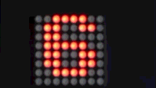
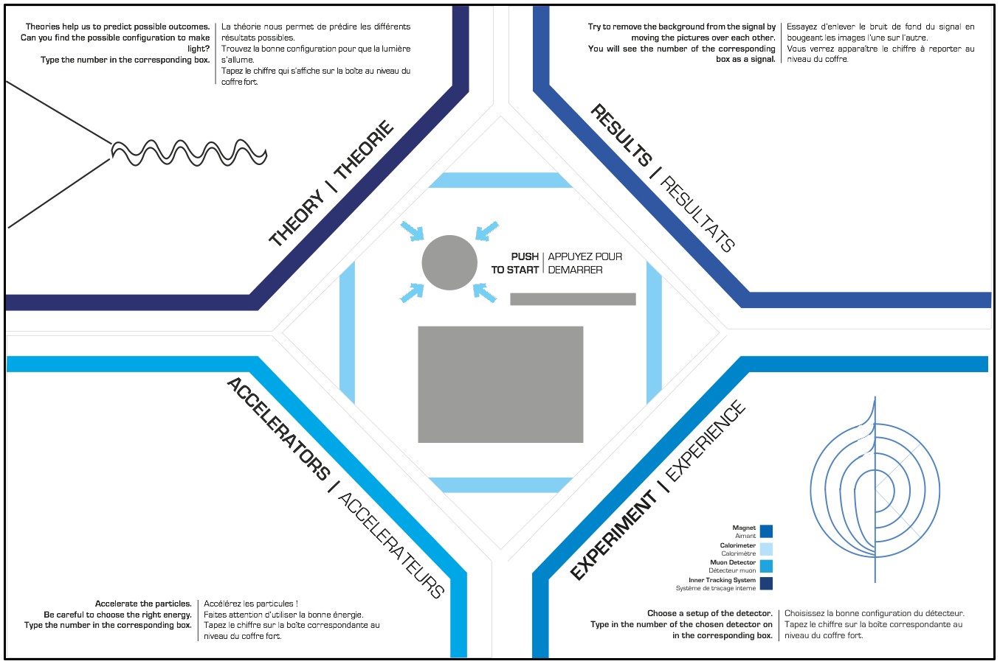
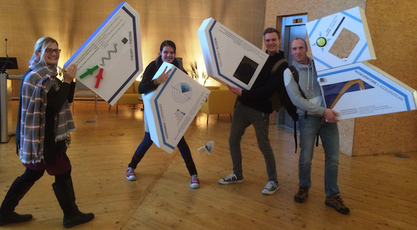
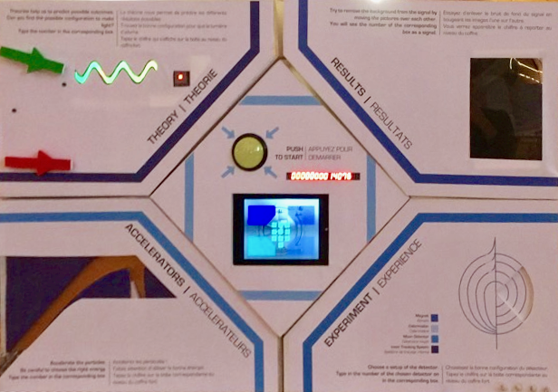

# 

## What

In November 2017, [CMS](https://home.cern/about/experiments/cms) and [ATLAS](https://home.cern/about/experiments/atlas) (both [Cern](https://home.cern) experiments), launched a competition to design an exhibit prototype for the [LHC accelerator](https://home.cern/topics/large-hadron-collider), explaining “**why we do what we do**” at [Cern](https://home.cern).

This repository contains information, design, schematics, drawings... concerning the award-winning project for this [LHCreate 2017 hackathon](https://lhcreate.web.cern.ch) at [Cern](https://home.cern)'s [IdeaSquare](http://ideasquare-dev.web.cern.ch).

## Why

Scientists, often fascinated by their very specific field of competence, easily end up in a delirium when trying to explain what they are actually doing. This results in an exciting subject like physics becoming extremely unclear for friends and family. This prototype aims at showing in an interactive way how accessible science really is.

## How

A heterogeneous mix of enthusiastic people, who never met each other before, have been put together in a blue container for two days. Ok, let's give them some names... Claudia, James,  Laura, Maëlys, Marina and Carl started brainstorming on the subject. After a couple of hours of crazy ideas from the [Cern](https://home.cern) physicists, engineers and IT'ers, they hit the brakes, and started involving their artistic designers from [IPAC Design](https://www.ipac-design.ch) in Geneva. Now things really got moving. Finally, an interactive, scientifically correct exhibit, which also looks good, was born !

### :sparkles: :sparkles: :sparkles: :sparkles: :sparkles: :sparkles: The inverse escape room game - Break into CERN ! :sparkles: :sparkles: :sparkles: :sparkles: :sparkles: :sparkles:  

#### Reveal the four-digit pin-code to open the vault !!

   

#### It's all about curiosity...

## How to play the game

The four modules around the central cube each contain an enigma to solve. When having found a solution, a digit will appear in the concerning module. The combination of these four digits can then be combined to a pin-code to open the vault in the central cubicle. It will give access to......... Ok, that you will have to find out yourself :wink:

The enigmas in the modules have been built around a variety of subjects which trigger the curiosity of both scientists and engineers at [Cern](https://home.cern). Each of the enigmas represent an important group of researchers working in and around the accelerator complex in Geneva. It all starts with a theory. Next the experimentalists accelerate particles in the 'big' machine, to make collisions for the researchers in their detectors. Finally, data scientists will process huge amounts of information to filter out what we really want to know.

### The Theory

...

### The Accelerator

...

### The Detector

...

### The Results

...  

## Project progress status

 - [x] have a [crazy idea](#how)
 - [x] decide on what is should [look](#how) like
 - [x] make it [interactive](#how)
 - [x] design and build a prototype [state-of-the-art housing](#mechanical-construction)  
 - [x] build air-wire/breadboard [prototype electronics](#how)
 - [ ] publish [mechanical build-files](pdf-files/) for the prototype
 - [x] publish (cleaned-up) prototype [code for the µ-controller](source/)
 - [ ] design and build a [public-proof housing](#mechanical-construction)
 - [ ] design a descent [electronics](#electronics) board
 - [ ] build a proof-of-concept for the final [electronics](#electronics) with appropriate [code for the µ-controller](#µ-controller-code)
 - [ ] design and build a [public-proof housing](#mechanical-construction) for the exhibit
 - [ ] write an [end-user manual](https://github.com/nostradomus/LHCreate-2017/wiki)

## How to build your own (technical details)

### Electronics

More coming soon.............

#### µ-Controller board

The brain of the system is based on an [ATmega328p](pdf-files/datasheet-ATmega328P.pdf) µ-controller (yes, like the [Arduino UNO](https://www.arduino.cc/)). The choice was pretty obvious for multiple reasons. The design is easy, the IDE is well-known, specific libraries exist for the communication with the different displays and addressable RGB LED's.

More coming soon.............

#### 16-digit display module

For the countdown timer in the central cube, a 16-digit 7-segment display module, which was lying around, has been used. After the hackathon, it turned out that the module was commercially not available anymore.

As all the required components can still easily be sourced, it was decided to redesign a pcb with the original components for future integration. All design-files and necessary information can be found in the [concerning repository](https://github.com/nostradomus/tm1640_16-digit_display).

#### Communication board

More coming soon.............

### µ-Controller code

The software has been written in the free [Arduino IDE](https://www.arduino.cc/en/Main/Software), or as [sourcecode](https://github.com/arduino/Arduino/). Three specific libraries are required to build this project successfully :

function                                    | library                                                | documentation
--------------------------------------------|--------------------------------------------------------|----------------------------------------------------------
16-digit display driver (tm1640 chip)       | [link](https://github.com/rjbatista/tm1638-library/)   | [link](https://github.com/rjbatista/tm1638-library/wiki)
8x8 LED matrix display driver (max7219 chip)| [link](https://github.com/wayoda/LedControl/)          | [link](http://wayoda.github.io/LedControl/)
neopixel LED driver (WS2812b LEDs)          | [link](https://github.com/adafruit/Adafruit_NeoPixel/) | [link](https://learn.adafruit.com/adafruit-neopixel-uberguide)

This [source folder](source/) contains snapshots from these libraries at the time of build (tested version). Libraries can be installed using the [standard procedure](https://www.arduino.cc/en/Guide/Libraries).

As the application has been written as an Arduino sketch, there are various ways to load the code in the controller. As a universal solution, I used the ICSP connector on the µ-controller board in combination with my [programming shield](https://github.com/nostradomus/ATtinyISPprogrammerShield). Instructions on how to proceed can be found in [this repository](https://github.com/nostradomus/ATtinyISPprogrammerShield). A basic serial-to-USB adapter has been connected to debug the application. You can use your favorite serial console software, or use the [python script](tools/SerialMonitor.py) included in the [tools folder](tools/) of this project.

Below firmware is available in the [source folder](source/) :

version | name                                        | description
--------|---------------------------------------------|--------------------------------------------------------------------------------------------
v1.0    | [central_cube.ino](source/central_cube.ino) | cleaned-up and commented version, with improved display animation, and sound
v1.0    | [feynman_cube.ino](source/feynman_cube.ino) | cleaned-up and commented version, with improved digits, two different animations, and sound
v1.0    | [pinball_cube.ino](source/pinball_cube.ino) | cleaned-up and commented version, with improved digits, two different animations, and sound

### Mechanical construction

The prototype housing has been built with ultra-light sandwich panels. The front and side panels for this modular housing have been designed using [Adobe InDesign](http://www.adobe.com/products/indesign.html). different files have been exported to [pdf format](pdf-files/modules-graphical_design.pdf) for easy printing on a plotter-like printer (A1 size required).

The housing for the electronics consists of several layers of lasercut and engraved plexi plates (3 & 6mm). The required files to cut out these plexi sheets are available both in [.cdr or CorelDraw format](laser-cutting-files/) or in [pdf format](pdf-files/). A legend on which color to use for which action (contour cutting, inside cut-outs, engraving) is available as an instruction in the [readme document](laser-cutting-files/README.md) which is accompanying the files.

### Building instructions

More coming soon.............

## Contributors

If you are having any good suggestions, just drop me a line [:email:](http://nostradomus.ddns.net/contactform.html).
If feasible, I'll be happy to implement proposed improvements.
And if you are having lots of time, I'll be happy to share the work with you ;-).

When you create your own version, don't forget to send us some nice pictures of your construction. We'll be happy to publish them in the :confetti_ball:Hall of Fame:confetti_ball:.

## :globe_with_meridians: License

At this moment, there is no specific license attached to this project yet.

So, today, if you like it, have fun with it (at your own risk of course :-D), and especially, be creative.

Oh, and when using anything from this repository, it is highly appreciated if you mention its origin.

If you would like to use any of this work (or the whole project) for commercial use, first [contact us :email:](http://nostradomus.ddns.net/contactform.html), so we can add the appropriate license, which best fits your business.
